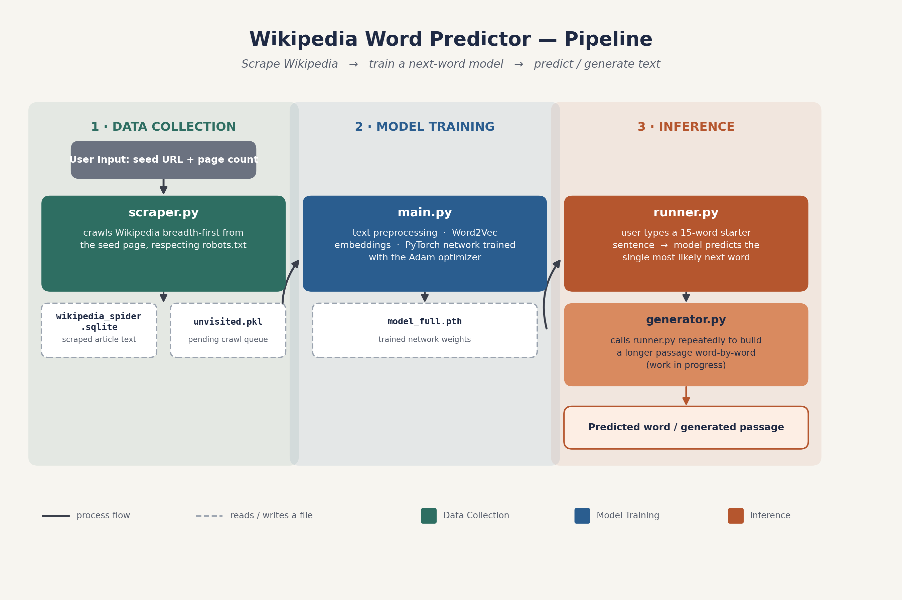

## Portfolio

---

### Machine Learning Projects

[StockWeeklyPerformancePredictor](https://github.com/VibhasBhaskar13/StockWeeklyPerformancePredictor)

---

[Wharton Data Science Competition](https://wsb.wharton.upenn.edu/wharton-data-competition/)

---

[WikiWordPredictor](/sample_page)

---

### Other Projects

- [EduShare](https://www.youtube.com/watch?v=L9WeJtize48)
- [errorCoach](https://pypi.org/project/errorCoach/)

---

---

Page template forked from <a href="https://github.com/evanca/quick-portfolio">evanca</a>

<!-- Remove above link if you don't want to attibute -->
